# Neural ODE for combustion reaction modelling
## Abstract

## 1. Neural network for reaction modelling in combustion
Neural network has been used to flamelet modelling.[]
Combined with unsupervised SOM, neural network has been used for chemistry ode integration for fixed time steps.[]
With the rapid growth in deep learning, modern neural network designs have been used to solve combustion chemistry [] with great success. However so far most application of the deep neural network are still focusing on a static neural network, the computational graph of the network are fixed during the inference. In this paper we show that by combining neural network with ODE numerics, the dynamic nerual ODE network can offer great computational saving and flexbility to chemical reaction modeling in combustion.

### Neural ODE
Common neural network is stationary. 
There are similarity between residual network and ODE.
Combine neural network and numerical ODE solution, a dynamic network can be built for simulating time series. We will use such neural ode network for combustion modelling. 

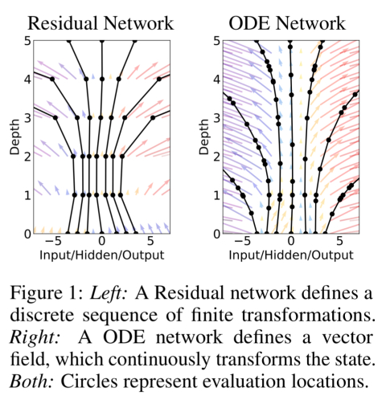

#### Equivalent 'depth' of the network
In the dynamic ODENet the depth of the network is equivalently the iteration in the adaptive method. When combined with modern adaptive ODE method, it offers the user great flexibility of balancing accuracy and computational cost. 

## 2. Chemical reaction ODE in combustion.
In combustion modelling the chemical reaction are usually seperated from the turbulent transport modelling by time split. The integration of the chemical ode is performed independantly and used as a numerical source term in the partial differential equation for the flow field. 
combustion process can be represented as a reaction ODE system coupled with thermal dynamics.

$
dcdt=\omega
$

$
f(p,V,T)=0
$

Solving the thermal reaction ode system can take up to 90% of the whole computation time. It is the most time comusing part of combustion modelling. 
The two main reason for the huge cost of solve the chemical ode are the expensive evaluation of the reaction rate, which involves a series of expensive exponential calculation and the stiffness of the chemsitry, which requires a iterative solution algorithsm. 

$
\omega = k[A]^m[B]^n
$

$
k=Aexp[-(E_{\alpha}/{RT})^{\beta}]
$

XX have used the neural network for solving such problem. Thanks to the effective numerical property of the neural network. 1000x of efficiency again have been demonstrated. However, in the published work, the time step is implicitly build into the training data and the user can not varing it at simulation time. In this work, we show that the dynamic ODE network provides a elegent solution to such problem. 

### 3.3. Explicit ODE solvers 

Different ODE solution algorithm can be chosen to compose the ODENet. To solve for a ODE

$dy/dx=f(x,y)$,

 we are testing euler method, midpoint method, runge-kutta method, as well as an adaptive method here. 

#### Euler method
Euler method is the simplest ODE solution method.

$k_1 = hf(x_n,y_n)$

$y_{n+1}=y_{n}+k1$

#### Midpoint method
The midpoint method, also known as the second-order Runga-Kutta method, improves the Euler method by adding a midpoint in the step which increases the accuracy by one order.

$k_1=hf(x_n,y_n)$

$k_2=hf(x_n+h/2,y_n+h/2)$

$y_{n+1}=y_n+k_2$

#### RK45
The fourth-order Runge-Kutta method is by far the ODE solving method most often used. It can be summarized as follows:
$k_1=hf(x_n,y_n)$

$k_2=hf(x_n+h/2,y_n+k_1/2)$

$k_3=hf(x_n+h/2,y_n+k_2/2)$

$k_4=hf(x_n+h,y_n+k_3)$

$y_{n+1}=y_n+1/6(k_1 + 2k_2+2k_3+k4)$

It needs to be pointed out here, in the ODE network, the base network is representing the gradient function $f(x,y)$. When the time step is set equally, there is a linear increase in inference computation cost from Euler to RK45 solver. However, since the neural network is demonstrated to be 100x faster compring to conventional ode integration[stalios], such linear computation cost increase is trivia.

## 3. Neural ODE network design and training
### 3.1. Multi branch bottle neck network
A multi branch bottleneck network is selected as the base network. Since the introduction of residual network, it has been proven to be the most effective simple topologic structure for building deep neural network. A small varient of the residual block has been used in this study as the base network. 
The network is composed by multiple identical parallel branches that are concatenated at the skip connnection layer. This effectively created a information 'bottleneck' which helps to compress the representation learned by individual neurons in the uper stream. Averaging a set of independently trained networks is an effective solution to improving accuracy. This basenetwork topology can be loosely interpreted as an ensemble of smaller residual networks, which  aggregate a set of
transformations. While we should point out that the members to be aggregated are trained jointly, not independently.
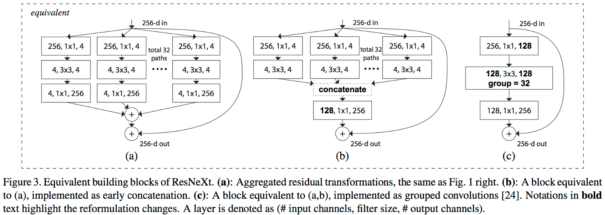

### 3.2. training for numerical gradient
The training dataset can be generated by solving a coupled chemical and thermo daynamic equations for varing initial conditions at small $\Delta t$. The concentration and relavent thermo quantities will be used as the input features and the related gradient are the labels. In this study we chose hydragen and air combustion in constant atmophere pressure as an example. $\Delta t$ is set to be 3e-8. By varing initial H2 mass fraction and temperature, the training dataset consists 20milion concentration/production rate pairs. 

Adam is the chosen the optimizer. Batch size is set to 1024*8. The network has been trained with 2000 epochs and converged at an  validation accuracy 0.98.

The R2 plots are selected and shown in the paper. 
r2 shows that the learning is successful.

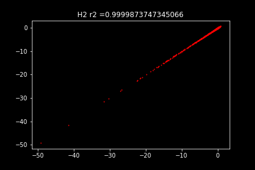
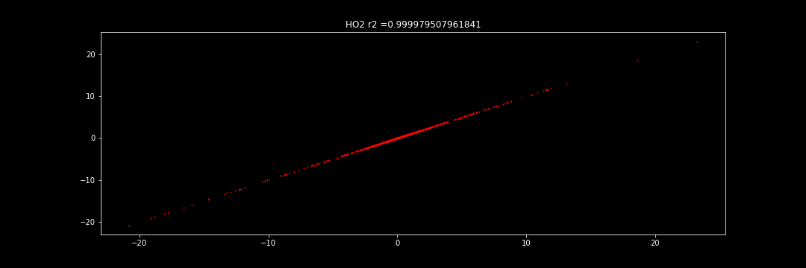
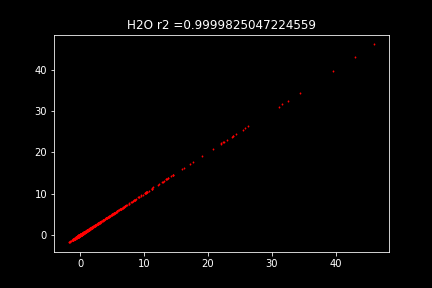

## 4.Result
### 4.1 Stiffness in combustion modelling
combustion ODE system often has stiffness. It poses a great efficency challenge. 

Taking modelling of flame propagation as an example. We learned about this example from Larry Shampine, one of the authors of the MATLAB ODE suite. When you light a match, the ball of flame grows rapidly until it reaches a critical size. Then it remains at that size because the amount of oxygen being consumed by the combustion in the interior of the ball balances the amount available through the surface. The simple model is
$dy/dt = y^2 + y^3$
$y_0=\delta$
$0< t < 2/\delta$
The scalar variable $y(t)$,y(t) represents the radius of the ball. The $y2$ and $y3$ terms come from the surface area and the volume. The critical parameter is the initial radius, $\delta$, which is "small." We seek the solution over a length of time that is inversely proportional to $\delta$.

Here we set $\delta =0.01$. When explicity RK45 solver is chosen, after $t=1/\delta$, the gradient changes rapidly.

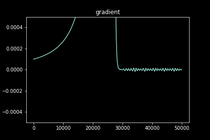
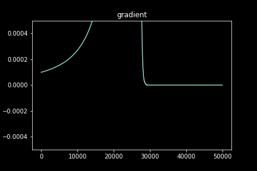

To comply with the relative tolerence, the solver needs to iterate over very small step resulting more iteration. In contrast, the more complex implicit method can take larger time step. 

When preparing the training data for the neural ODE, we can accumulate the gradient with the implicit solver and thus the ODENet won't have the inherent stiffness that comes from the ODE. In the end, we can have a stable ODE net that consist of computational efficent explicit method. The ode Net results shows that it can combine the advatages of both explicit and implicit solver. To achieve the same accuracy tolerence, it can use large time without implicit expensive iterative update.

### 4.2 Model validation: H2 ingition under constant pressure 
H2 is burned in air with a give initial temperature under atmosphere pressure.This validation setup has a clear numerical formulation. The H2 chemistry is represented with the sandiego mechanism coupled with ideal gas equation of state. H2 chemistry is chosen because its non stiff, so the selected ODE solvers are applicable. Besides, H2 combustion reactions are vary fast with strong gradient changes, which poses great challenges for the base network block. 

At different integration time step $\Delta t$ the odeNet results are compared with original ODE solution. In previous section, it has been shown that the base neural network gives a good representation of the rate of change, here we will only compare the results from stoichiometic initial mass fraction at $ T_{ini}=1401$. 

### 4.1 The effect of time step size
We will fist inspect the effect of integration time step to the ODE Net. Here we select $\Delta t =$ 1e-6 and 1e-7. 
From the numerical integration formular, it is clear that the accuracy of the integration is directly related to the gradient and time step. When the gradient changes drasticly, one need smaller time step and large step size can be accepted when the gradient changes little. 

H2 combustion is a vary fast reaction. As can be seen from the figure, all the H2 is burnd in a very shot time. In the strong burning phase, when the step size is set to $\Delta t = $1e-6, there are significant difference between the ODE Net prediction and the grund truth. For some species that difference can be close to 10%.In this case, reducing the $\Delta t$ to 1e7 effectively increases the accuracy. Take H2 for example, after reducing the $\Delta t$ to 1e-7, the relative error has drop from 6% to 0.6% in the strong burning phase. 

By comparing different integration time step, we have shown that the ODE Network can effectively handle varing time steps in turbulent combustion. Which greatly extends its application into combustion modelling. 

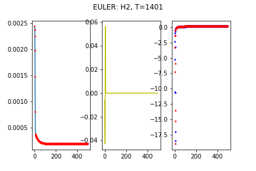
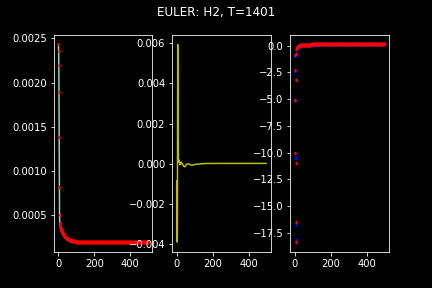
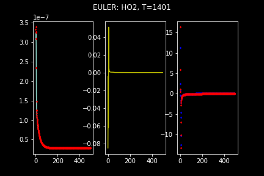
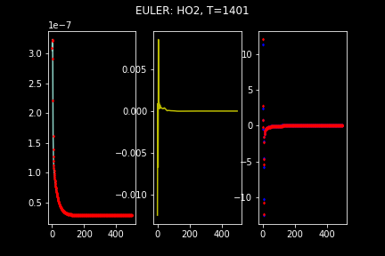
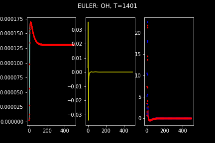

### 4.2 The effect of different ODE solver
Euler solver is the simplest ODE solver, at a given time step, based on the ode numerics we can expect an improved in accuracy with higher order ode solvers[]. And this is backed by the results in Figure. 

In this comparison, $\Delta t$ is set to be 1e-7. The relative error for euler, midpoint and runge-kutta methods are drawn. 

Changin from the first oder euler method to second oder midpoint method, there are a significant over 60% drop in max relative error. While the impovement over 2nd order midpoint method to 4th order rungu-kutta method is not so obvious. From the numerical effiecency consideration, it suggest that 2nd oder ode solver is ideal for ODE Network. 

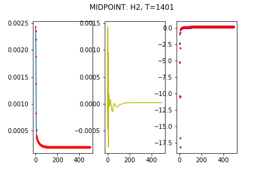
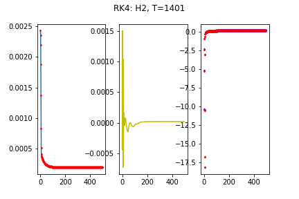
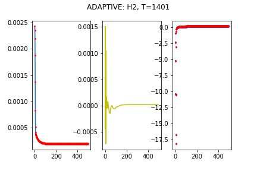

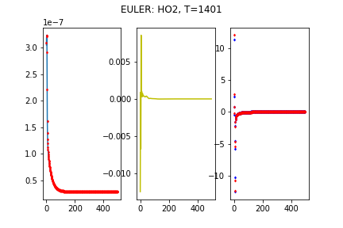
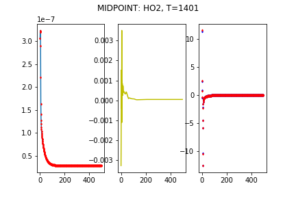
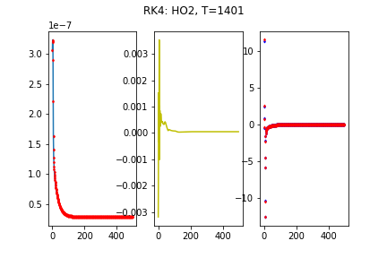
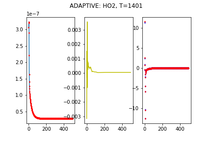

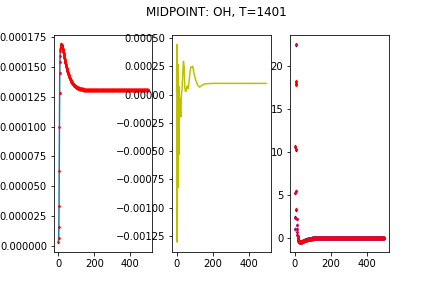

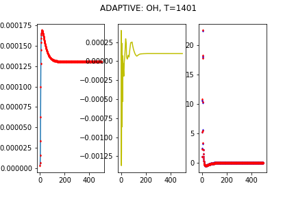

It can be seen from the results that ODENet gives a consistent prediction of the chemical concentration. The naive Euler method gives a reasonable result at very low computational cost. The higher order ODE solver yield better accuracy. To balance efficency and cost, adavanced adaptive ode solver can be adopted. 

## 5. Conclusion
Neural ODE network combines neural network with ODE solution. The end results, the dynamic ODENet offers a great tool for reaction ODE modelling in combustion simulations. Unlike ealier attents to apply neural network in combustion simulation, ODENet doesn't require specific optimization for each species[], or extra clusttering step like SOM[]. In the H2 ingition test case, the ODENet has shown a steady control of error tolerance. Thanks to the morden network stucture and GPU accelation. ODENet offers a significat boost in reaciton modelling efficiency in combustion modelling. 
The next step will be integrating the neural ODE network into a turbulent combustion simulation. 
