# OpenFOAM meeting
## 1. VS code remote
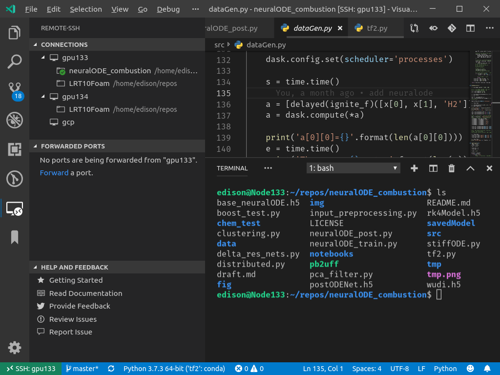

## 2. Dask
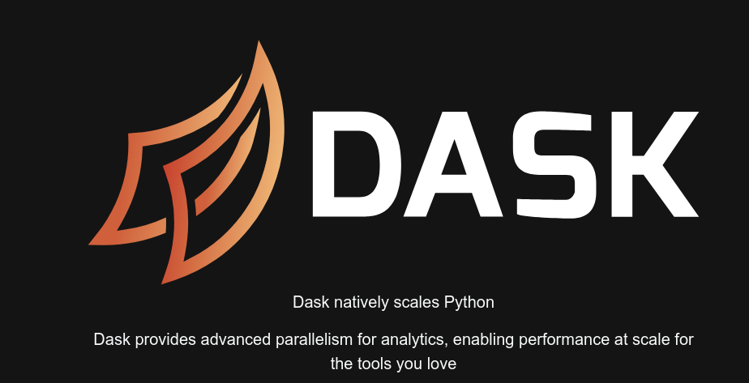

**Dask in action**

## 3. Neural ODE for chemical reactions
- **MLP**

- **Deep Neural Networks**

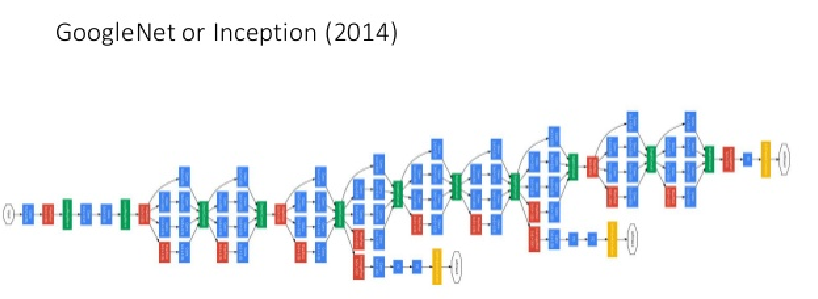
- **Neural ODE**

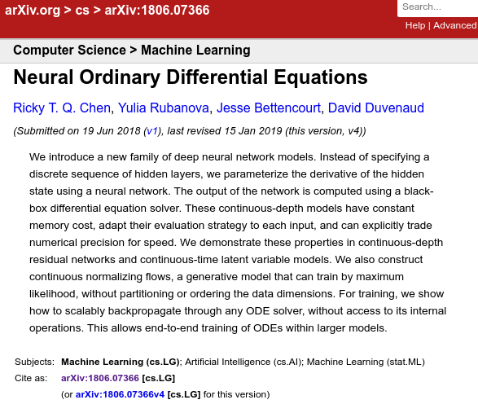

- **Runge kutta network**

**Runge kutta 4th order method**

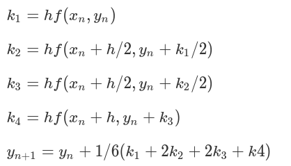

**RK45Network**
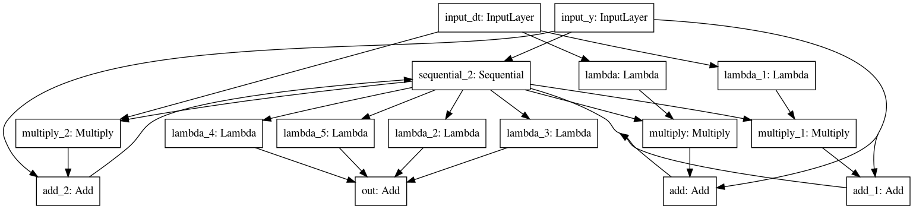

**H2 auto ignition**
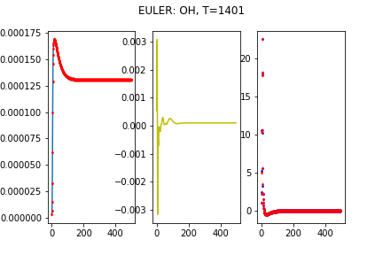
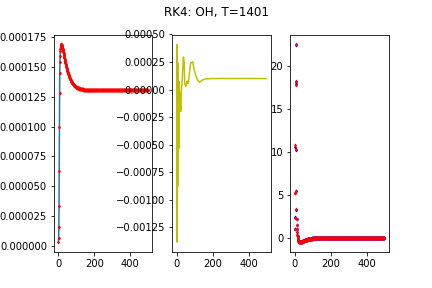

- **explicit or implicit**
**flame expansion**
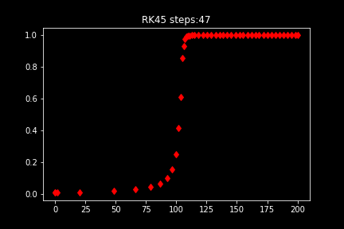
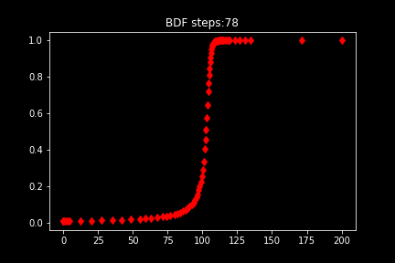
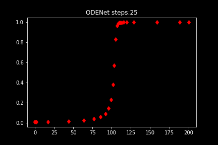

## Star me on github
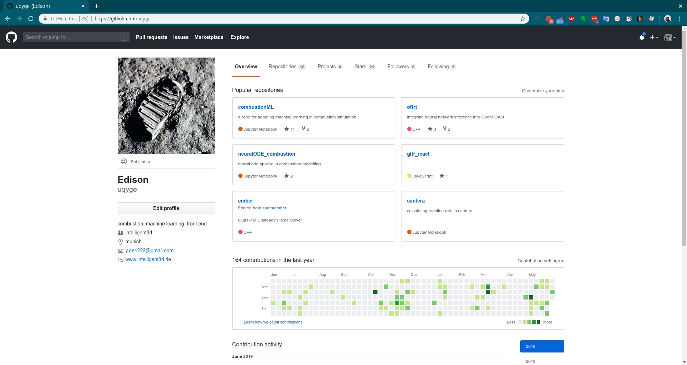
[https://github.com/uqyge/neuralODE_combustion](https://github.com/uqyge/neuralODE_combustion)